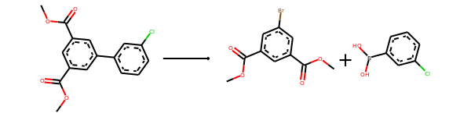
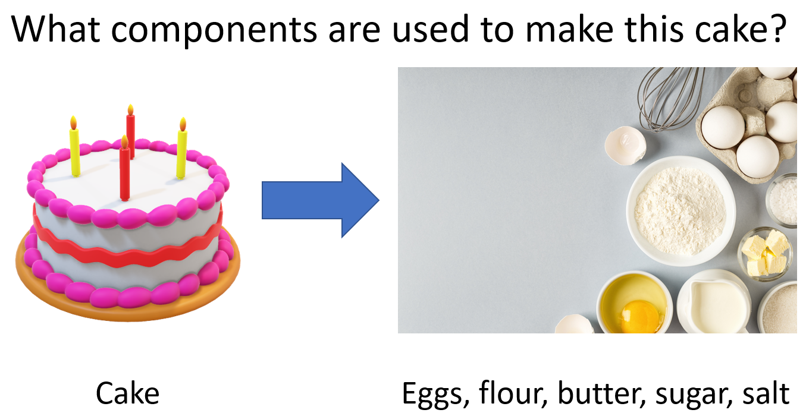

# Retrosynthesis

[Retrosynthesis](https://en.wikipedia.org/wiki/Retrosynthetic_analysis) predicts what molecules were used to produce (or synthesize) a given chemical. It's like if I showed you a cake, then you would say "I need flour, water, eggs, sugar, baking soda, butter, and salt to create that cake." 

[E. J. Corey](https://en.wikipedia.org/wiki/Elias_James_Corey) was awarded the [1990 Nobel Prize in Chemistry](https://www.nobelprize.org/prizes/chemistry/1990/summary/) for his work in "organic synthesis" (which includes retrosynthesis). There are many variations on recipes to make a cake (even if you use the same ingredients). Similarly, retrosynthesis algorithms help chemists identify new (and possibly easier/cheaper/faster) methods of creating drugs for the pharmaceutical industry.

In this notebook, we'll attempt to build a machine learning model for retrosynthesis predictions.  

